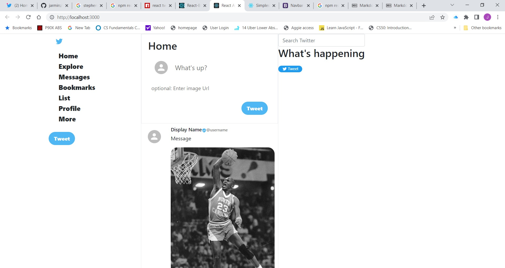

# Twitter clone project

##TODO LIST
-add Twitter icons
-complete widget section
-add login component

- include wireframes in your github repo
- include tests for your React application
  -complete functionaity
  -Must be deployed using github pages
  -add Firebase DB

##initial Phase Screen Shot

